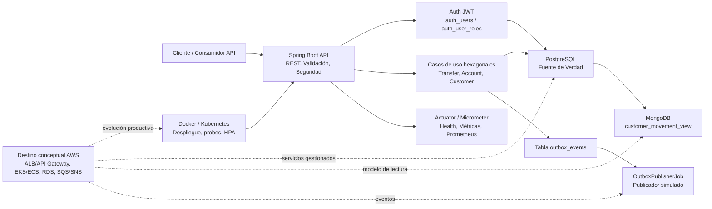
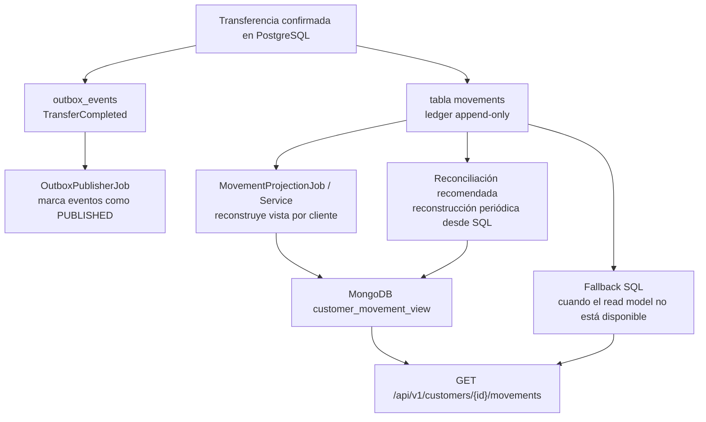
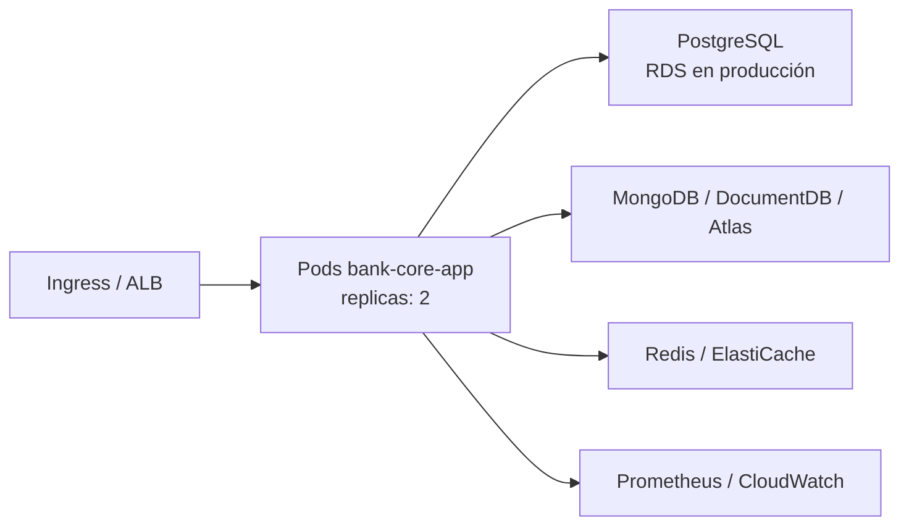

# Arquitectura

Este documento resume la arquitectura técnica de `bank-core-evolution-lab` y las decisiones principales detrás del flujo de transferencias bancarias.

## Decisión Arquitectónica

El sistema se mantiene como **monolito modular hexagonal**, no como microservicios.

La razón es deliberada: el caso crítico de negocio es la transferencia interna, que
requiere una transacción corta y consistente sobre cuentas, movimientos,
idempotencia, auditoría y outbox. Separar esos límites en microservicios ahora
obligaría a resolver sagas, compensaciones, retries distribuidos, versionamiento de
contratos y observabilidad distribuida antes de que exista una necesidad operativa
real.

La modularización sí prepara el camino para una extracción futura: cada bounded
context mantiene su propio `domain`, `application` e `infrastructure`.

## Hexagonal Por Módulo

```text
account | customer | transfer | movement | audit | outbox
├── domain
├── application
│   ├── port
│   │   ├── in
│   │   └── out
│   └── *Service
└── infrastructure
    └── adapter
        ├── in
        │   ├── web
        │   └── scheduler
        └── out
            ├── persistence
            ├── mongo
            └── publisher
```

Reglas aplicadas:

- Los adaptadores de entrada llaman puertos de entrada (`UseCase`).
- Los casos de uso dependen de puertos de salida, no de repositorios Spring Data.
- Los DTOs HTTP viven en adaptadores web.
- JPA, MongoDB, jobs, métricas, JWT y publicación simulada son infraestructura.
- El dominio concentra entidades y reglas de negocio como saldos, estados y bloqueo.

## Arquitectura General



Puntos clave:

- PostgreSQL mantiene la verdad transaccional: saldos, transferencias, movimientos, auditoría, idempotencia y outbox events.
- MongoDB es un modelo de lectura optimizado para historial de movimientos por cliente.
- El outbox pattern mantiene el estado de negocio y los eventos de integración confirmados atómicamente.
- Actuator y Micrometer exponen señales operativas para health checks y monitoreo.
- Docker Compose soporta ejecución local; Kubernetes muestra preocupaciones de despliegue más cercanas a producción.

## Secuencia de Transferencia Interna

```mermaid
sequenceDiagram
    autonumber
    actor Cliente
    participant Controller as TransferController
    participant Service as TransferService
    participant Idempotency as IdempotencyService
    participant AccountRepo as AccountRepository
    participant PostgreSQL
    participant Audit as AuditService
    participant Outbox as OutboxEventRepository

    Cliente->>Controller: POST /api/v1/transfers<br/>Idempotency-Key + body
    Controller->>Service: create(request, key, actor, channel, correlationId)
    Service->>Idempotency: findCompletedResponseOrCreateRecord(key, bodyHash)
    Idempotency->>PostgreSQL: insert/select idempotency_records

    alt misma key y respuesta completada existe
        Idempotency-->>Service: TransferResponse almacenado
        Service-->>Controller: misma respuesta, sin débito
        Controller-->>Cliente: 201 Created
    else nueva key de idempotencia
        Idempotency-->>Service: empty
        Service->>AccountRepo: findAllByAccountNumberInForUpdate(source, target)
        AccountRepo->>PostgreSQL: SELECT accounts FOR UPDATE
        PostgreSQL-->>AccountRepo: cuentas bloqueadas
        Service->>Service: validar cuentas activas, moneda y saldo
        Service->>PostgreSQL: guardar Transfer(PENDING)
        Service->>PostgreSQL: debitar cuenta origen
        Service->>PostgreSQL: acreditar cuenta destino
        Service->>PostgreSQL: insertar movimientos DEBIT y CREDIT
        Service->>Audit: registrar TRANSFER_COMPLETED
        Audit->>PostgreSQL: insertar audit_logs
        Service->>Outbox: crear TransferCompleted
        Outbox->>PostgreSQL: insertar outbox_events
        Service->>Idempotency: guardar respuesta serializada
        Idempotency->>PostgreSQL: actualizar idempotency_records
        Service-->>Controller: TransferResponse
        Controller-->>Cliente: 201 Created
    end

    Cliente->>Controller: reintento con misma Idempotency-Key y mismo body
    Controller->>Service: create(request, key, ...)
    Service->>Idempotency: findCompletedResponseOrCreateRecord(key, bodyHash)
    Idempotency-->>Service: TransferResponse almacenado
    Service-->>Controller: misma respuesta, sin segundo débito
    Controller-->>Cliente: 201 Created
```



## Consistencia Eventual SQL a MongoDB



El modelo de consistencia es intencionalmente eventual:

- SQL es la fuente de verdad y puede reconstruir cualquier proyección.
- MongoDB está optimizado para lectura y puede tener retraso frente a los datos confirmados en SQL.
- Si MongoDB no está disponible o la vista está vacía, la API puede caer a SQL.
- En producción, los jobs de reconciliación deberían detectar proyecciones faltantes, duplicadas o atrasadas.

## Vista de Despliegue



Evolución productiva:

- Reemplazar los manifiestos locales de PostgreSQL por RDS PostgreSQL Multi-AZ.
- Reemplazar los manifiestos locales de MongoDB por MongoDB Atlas o DocumentDB.
- Reemplazar JWT demo local por OAuth2/OIDC con un proveedor de identidad.
- Reemplazar el publicador outbox simulado por Kafka, SQS/SNS, RabbitMQ o MSK.
- Agregar tracing centralizado, alertas, dashboards y runbooks.
